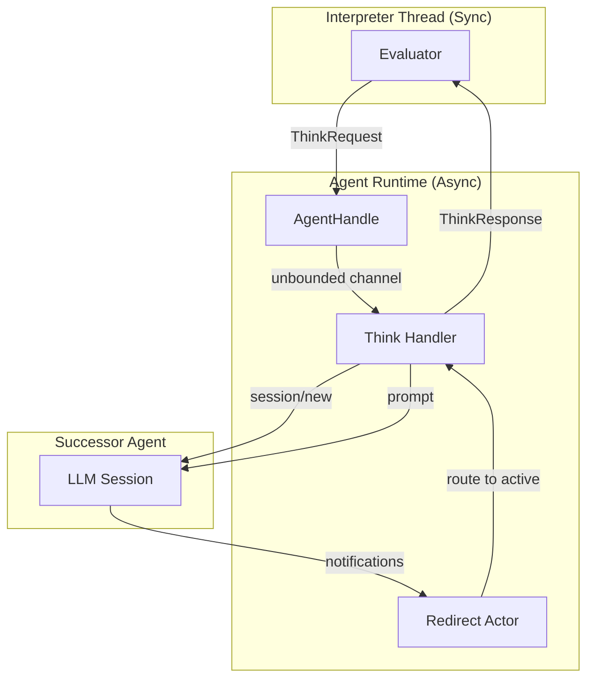
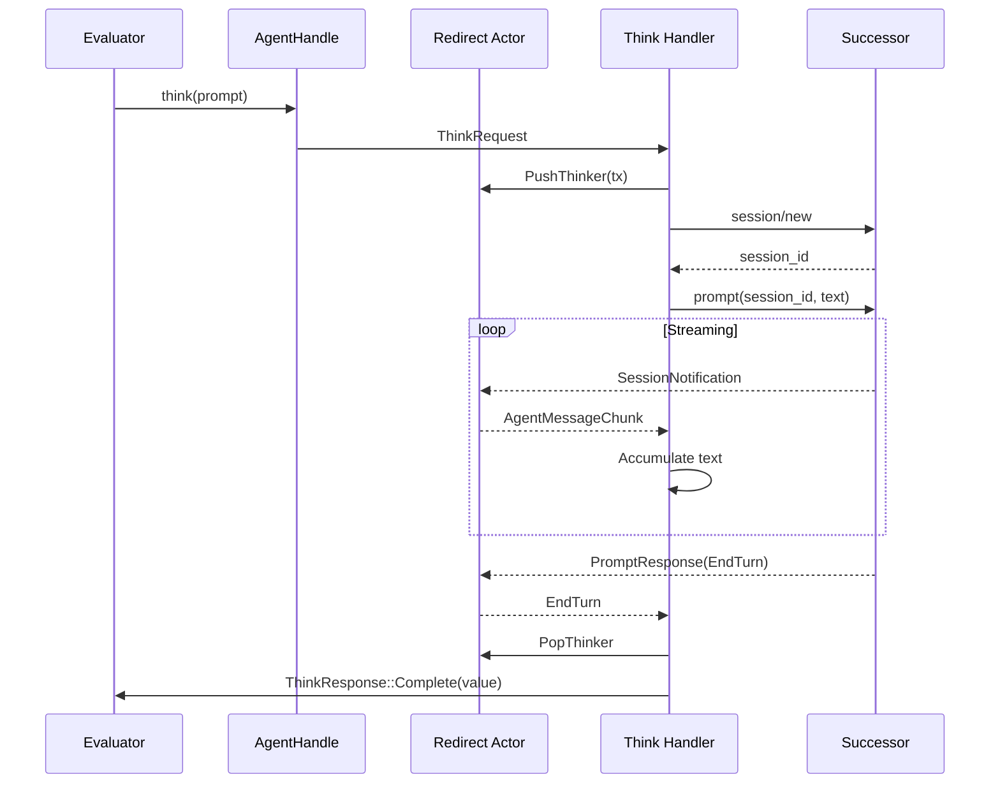

# The Agent

The agent bridges the synchronous interpreter to asynchronous LLM sessions. It receives think requests, manages LLM communication, and routes responses back to waiting interpreter threads.

## Architecture Overview



The key insight: **the interpreter is synchronous, but LLM communication is async**. The agent manages this boundary using channels and a dedicated routing actor.

## AgentHandle

The `AgentHandle` is the interpreter's interface to the agent:

```rust
#[derive(Clone)]
pub struct AgentHandle {
    tx: UnboundedSender<ThinkRequest>,
}

impl AgentHandle {
    pub fn think(
        &self,
        prompt: String,
        bindings: HashMap<String, Value>,
        expect: String,
    ) -> Result<mpsc::Receiver<ThinkResponse>, String> {
        // Create response channel
        let (response_tx, response_rx) = mpsc::channel();

        // Send request (non-blocking)
        self.tx.send(ThinkRequest {
            prompt,
            bindings,
            expect,
            response_tx,
        })?;

        // Return receiver for blocking
        Ok(response_rx)
    }
}
```

The handle is `Clone`, so it can be passed to multiple interpreter threads. Each call to `think()` creates a fresh response channel, so responses route to the correct waiter.

## The Redirect Actor

When nested think blocks occur, multiple LLM sessions may be active simultaneously. The redirect actor maintains a stack of active sessions and routes incoming messages to the correct one:

```rust
async fn redirect_actor(mut rx: UnboundedReceiver<RedirectMessage>) {
    let mut stack: Vec<Sender<PerSessionMessage>> = vec![];

    while let Some(message) = rx.recv().await {
        match message {
            RedirectMessage::IncomingMessage(msg) => {
                // Route to top of stack (innermost active think)
                if let Some(sender) = stack.last() {
                    sender.send(msg).await?;
                }
            }
            RedirectMessage::PushThinker(sender) => {
                stack.push(sender);
            }
            RedirectMessage::PopThinker => {
                stack.pop();
            }
        }
    }
}
```

This stack-based routing enables nested think blocks: when an outer think triggers code that contains an inner think, the inner one pushes onto the stack and receives messages until it completes.

## The Think Message Flow

When a think request arrives, the agent:

1. Creates a new session with the successor agent
2. Pushes itself onto the redirect stack
3. Sends the prompt
4. Accumulates the response
5. Pops from the stack and returns

```rust
async fn think_message(
    cx: JrConnectionCx,
    prompt: String,
    expect: String,
    state: Arc<AgentState>,
) -> ThinkResult {
    // 1. Augment prompt with type hints
    let augmented_prompt = augment_prompt_with_type_hint(&prompt, &expect);

    // 2. Create session with successor
    let NewSessionResponse { session_id, .. } = cx
        .send_request_to_successor(NewSessionRequest { ... })
        .block_task()
        .await?;

    // 3. Push onto redirect stack
    let (think_tx, mut think_rx) = channel(128);
    state.redirect_tx.send(RedirectMessage::PushThinker(think_tx))?;

    // 4. Send prompt and wait for response
    cx.send_request_to_successor(PromptRequest {
        session_id,
        prompt: vec![augmented_prompt.into()],
    }).await_when_result_received(...);

    // 5. Accumulate response
    let mut result_text = String::new();
    while let Some(message) = think_rx.recv().await {
        match message {
            PerSessionMessage::SessionNotification(n) => {
                // Accumulate streaming text
                if let SessionUpdate::AgentMessageChunk(chunk) = n.update {
                    result_text.push_str(&chunk.content.text);
                }
            }
            PerSessionMessage::PromptResponse(_) => break,
            ...
        }
    }

    // 6. Pop and return
    state.redirect_tx.send(RedirectMessage::PopThinker)?;
    extract_response_value(&result_text, &expect)
}
```

## Sequence Diagram



## The "do" Tool

For nested evaluation, the agent exposes a "do" MCP tool that the LLM can invoke:

```rust
pub fn create_mcp_server(redirect_tx: UnboundedSender<RedirectMessage>) -> McpServer {
    McpServer::new()
        .instructions("Patchwork interpreter tools for recursive evaluation")
        .tool_fn(
            "do",
            "Execute a Patchwork code fragment by index",
            async move |arg: DoArg, _cx| -> Result<DoResult, Error> {
                let (result_tx, result_rx) = oneshot::channel();
                redirect_tx.send(RedirectMessage::IncomingMessage(
                    PerSessionMessage::DoInvocation(arg, result_tx),
                ))?;
                Ok(DoResult {
                    text: result_rx.await?,
                })
            },
        )
}
```

When the LLM calls `do(3)`, the agent routes this back to the interpreter for evaluation, then returns the result to the LLM.

## Response Extraction

The agent augments prompts with type hints and extracts structured responses:

```rust
fn augment_prompt_with_type_hint(prompt: &str, expect: &str) -> String {
    match expect {
        "string" => format!(
            "{}\n\nRespond with:\n```text\nyour response\n```",
            prompt
        ),
        "json" => format!(
            "{}\n\nRespond with:\n```json\nyour JSON\n```",
            prompt
        ),
        _ => prompt.to_string(),
    }
}

fn extract_response_value(response: &str, expect: &str) -> ThinkResult {
    // Find code fence with expected type
    if let Some(value) = extract_code_fence(response, fence_marker) {
        match expect {
            "string" => Ok(Value::String(value)),
            "json" => serde_json::from_str(&value).map(json_to_value),
            ...
        }
    } else {
        // Fallback: use full response
        Ok(Value::String(response.to_string()))
    }
}
```

This structured extraction lets think blocks return typed values, not just strings.

## Why This Design?

**Unbounded channels for requests**: The interpreter can send without blocking, even if the agent is busy. This prevents deadlock when nested thinks occur.

**Standard channels for responses**: The interpreter must block anyway, so `std::sync::mpsc` is simpler than polling.

**Stack-based routing**: Nested think blocks naturally form a stack. The innermost active session should receive messages; when it completes, the outer one resumes.

**MCP for tools**: The "do" tool uses MCP protocol, so it integrates with the successor agent's existing tool infrastructure.

## Next: The ACP Proxy

The agent handles think blocks, but how does Patchwork code get triggered in the first place? The [ACP Proxy](./acp-proxy.md) chapter explains how Patchwork integrates into the larger agent communication protocol.
