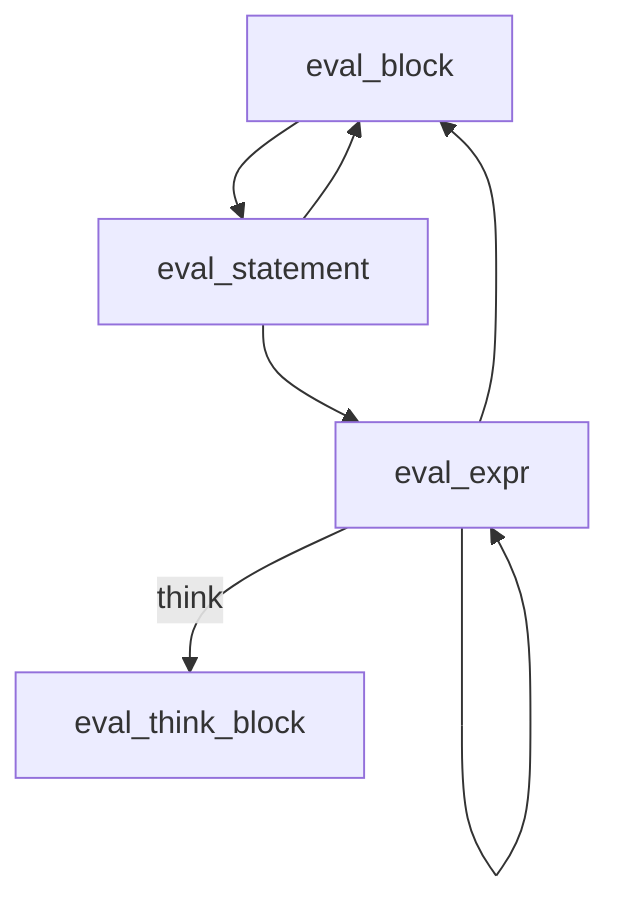

# The Evaluator

The evaluator walks the AST and executes each node. It's implemented in `crates/patchwork-eval/src/eval.rs`.

## Synchronous Evaluation Model

The evaluator uses a synchronous model where all functions return `Result<Value, Error>`:

```rust
pub fn eval_expr(
    expr: &Expr,
    runtime: &mut Runtime,
    agent: Option<&AgentHandle>,
) -> Result<Value, Error>
```

Even think blocks—which communicate with an external LLM—block the calling thread until the response arrives. This keeps the evaluation logic simple: no async/await, no futures, just straightforward recursive descent.

## Core Functions

The evaluator has three main entry points:

| Function | Purpose |
|----------|---------|
| `eval_block` | Evaluate a block of statements, returns last value |
| `eval_statement` | Evaluate a single statement |
| `eval_expr` | Evaluate an expression, returns a `Value` |



## Evaluating Blocks

A block creates a new scope, evaluates each statement, and returns the last value:

```rust
pub fn eval_block(
    block: &Block,
    runtime: &mut Runtime,
    agent: Option<&AgentHandle>,
) -> Result<Value, Error> {
    runtime.push_scope();
    let mut result = Value::Null;

    for stmt in &block.statements {
        result = eval_statement(stmt, runtime, agent)?;
    }

    runtime.pop_scope();
    Ok(result)
}
```

The `push_scope`/`pop_scope` calls ensure variables declared in the block don't leak out.

## Evaluating Statements

Statements dispatch on the AST node type:

```rust
pub fn eval_statement(stmt: &Statement, ...) -> Result<Value, Error> {
    match stmt {
        Statement::VarDecl { pattern, init } => { ... }
        Statement::Expr(expr) => eval_expr(expr, runtime, agent),
        Statement::If { condition, then_block, else_block } => { ... }
        Statement::ForIn { var, iter, body } => { ... }
        Statement::While { condition, body } => { ... }
        Statement::Return(expr) => { ... }
        ...
    }
}
```

### Variable Declaration

```rust
Statement::VarDecl { pattern, init } => {
    let value = match init {
        Some(expr) => eval_expr(expr, runtime, agent)?,
        None => Value::Null,
    };
    bind_pattern(pattern, value, runtime)?;
    Ok(Value::Null)
}
```

The pattern can be a simple identifier (`var x = 1`) or destructuring (`var {name, age} = person`).

### Control Flow

`if` evaluates the condition and picks a branch:

```rust
Statement::If { condition, then_block, else_block } => {
    let cond_value = eval_expr(condition, runtime, agent)?;

    if cond_value.to_bool() {
        eval_block(then_block, runtime, agent)
    } else if let Some(else_blk) = else_block {
        eval_block(else_blk, runtime, agent)
    } else {
        Ok(Value::Null)
    }
}
```

`for` iterates over arrays or string lines:

```rust
Statement::ForIn { var, iter, body } => {
    let iter_value = eval_expr(iter, runtime, agent)?;

    let items = match iter_value {
        Value::Array(arr) => arr,
        Value::String(s) => s.lines().map(|l| Value::String(l.to_string())).collect(),
        other => return Err(Error::Runtime(...)),
    };

    for item in items {
        runtime.push_scope();
        runtime.define_var(var, item)?;
        eval_block(body, runtime, agent)?;
        runtime.pop_scope();
    }
    Ok(Value::Null)
}
```

## Evaluating Expressions

Expressions return values. The big `match` covers all expression types:

```rust
pub fn eval_expr(expr: &Expr, ...) -> Result<Value, Error> {
    match expr {
        Expr::Identifier(name) => runtime.get_var(name).cloned()...,
        Expr::Number(s) => Ok(Value::Number(s.parse()?)),
        Expr::String(lit) => eval_string_literal(lit, runtime, agent),
        Expr::True => Ok(Value::Boolean(true)),
        Expr::Array(items) => { ... }
        Expr::Object(fields) => { ... }
        Expr::Binary { op, left, right } => eval_binary(...),
        Expr::Call { callee, args } => eval_call(...),
        Expr::Think(prompt_block) => eval_think_block(...),
        Expr::BareCommand { name, args } => eval_bare_command(...),
        ...
    }
}
```

### String Interpolation

Strings can contain interpolations like `"Hello ${name}"`:

```rust
fn eval_string_literal(lit: &StringLiteral, ...) -> Result<Value, Error> {
    let mut result = String::new();
    for part in &lit.parts {
        match part {
            StringPart::Text(s) => result.push_str(&process_escape_sequences(s)),
            StringPart::Interpolation(expr) => {
                let value = eval_expr(expr, runtime, agent)?;
                result.push_str(&value.to_string_value());
            }
        }
    }
    Ok(Value::String(result))
}
```

### Binary Operations

Binary ops handle arithmetic, comparison, and assignment:

```rust
fn eval_binary(op: &BinOp, left: &Expr, right: &Expr, ...) -> Result<Value, Error> {
    // Assignment is special - evaluate RHS, store in LHS
    if let BinOp::Assign = op {
        let value = eval_expr(right, runtime, agent)?;
        if let Expr::Identifier(name) = left {
            runtime.set_var(name, value.clone())?;
            return Ok(value);
        }
    }

    let left_val = eval_expr(left, runtime, agent)?;
    let right_val = eval_expr(right, runtime, agent)?;

    match op {
        BinOp::Add => { /* number add or string concat */ }
        BinOp::Sub | BinOp::Mul | BinOp::Div => { /* numeric ops */ }
        BinOp::Eq | BinOp::NotEq | BinOp::Lt | BinOp::Gt => { /* comparisons */ }
        BinOp::And | BinOp::Or => { /* logical ops */ }
        ...
    }
}
```

String concatenation happens when either operand is a string:

```rust
BinOp::Add => match (&left_val, &right_val) {
    (Value::Number(a), Value::Number(b)) => Value::Number(a + b),
    (Value::String(a), Value::String(b)) => Value::String(format!("{}{}", a, b)),
    (Value::String(a), b) => Value::String(format!("{}{}", a, b.to_string_value())),
    (a, Value::String(b)) => Value::String(format!("{}{}", a.to_string_value(), b)),
    _ => return Err(...),
}
```

## Builtin Functions

Builtins are handled specially in `eval_call`:

```rust
fn eval_builtin(name: &str, args: &[Value], runtime: &Runtime) -> Result<Value, Error> {
    match name {
        "print" => { runtime.print(...)?; Ok(Value::Null) }
        "len" => { /* array/string/object length */ }
        "read" => { /* read file contents */ }
        "write" => { /* write file contents */ }
        "json" => { /* parse JSON string */ }
        "cat" => { /* serialize to JSON */ }
        "keys" | "values" => { /* object introspection */ }
        "typeof" => { /* type name */ }
        _ => Err(Error::Runtime(format!("Unknown function: {}", name))),
    }
}
```

## Exception Propagation

Exceptions use `Error::Exception(Value)` and propagate via Rust's `?` operator:

```rust
// In eval_unary
UnOp::Throw => Err(Error::Exception(value))

// Callers automatically propagate:
let result = eval_expr(expr, runtime, agent)?;  // Exception bubbles up
```

This makes the control flow transparent—exceptions use the same mechanism as other errors.

## Shell Commands

Bare commands like `$ls -1` execute via the system shell:

```rust
fn eval_bare_command(name: &str, args: &[CommandArg], ...) -> Result<Value, Error> {
    let mut cmd_args = Vec::new();
    for arg in args {
        match arg {
            CommandArg::Literal(s) => cmd_args.push(s.to_string()),
            CommandArg::String(lit) => {
                let value = eval_string_literal(lit, runtime, agent)?;
                cmd_args.push(value.to_string_value());
            }
        }
    }
    exec_command(name, &cmd_args, runtime)
}

fn exec_command(name: &str, args: &[String], runtime: &Runtime) -> Result<Value, Error> {
    let output = Command::new(name)
        .args(args)
        .current_dir(runtime.working_dir())
        .output()?;

    if !output.status.success() {
        return Err(Error::Runtime(...));
    }

    Ok(Value::String(String::from_utf8_lossy(&output.stdout).into_owned()))
}
```

Commands run in the runtime's working directory, and stdout becomes the return value.

## Think Blocks: The Bridge to LLM

Think blocks are where the evaluator meets the agent. This is covered in detail in the [next chapter](./think-blocks.md), but the key insight is:

```rust
Expr::Think(prompt_block) => eval_think_block(prompt_block, runtime, agent)
```

The evaluator treats think blocks like any other expression—call a function, get a value back. The complexity of LLM communication is hidden behind `eval_think_block`.
