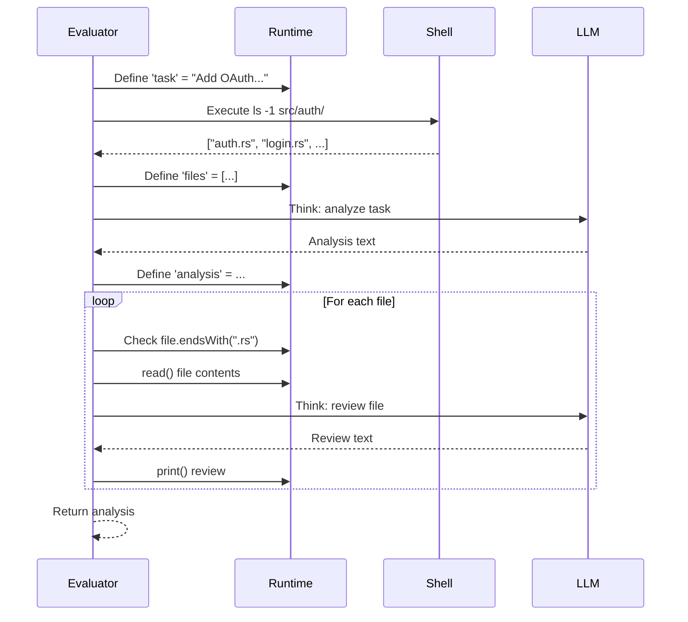

# An Example Program

Before diving into evaluation mechanics, let's look at a concrete Patchwork program. This grounds the concepts in something tangible.

## The Program

```patchwork
fun code_review_assistant() {
    var task = "Add OAuth support to the login system"
    var files = $ls -1 src/auth/

    var analysis = think {
        The user wants to: ${task}

        Relevant files in src/auth/:
        ${files}

        Please identify:
        1. Which files need modification
        2. What new files should be created
        3. Security considerations
    }

    for file in files {
        if file.endsWith(".rs") {
            var content = read("src/auth/${file}")
            var review = think {
                Review this file for OAuth readiness:
                ${content}
            }
            print("${file}: ${review}")
        }
    }

    return analysis
}
```

## What Happens at Runtime

When this function executes, several things interleave:



## Key Observations

**Variables are simple** - `var task = "..."` creates a binding in the current scope. The evaluator stores `Value::String` in the runtime's scope stack.

**Shell commands return values** - `$ls -1 src/auth/` executes `ls` and captures stdout. With `-1`, the evaluator splits the output into an array of lines.

**Think blocks block** - When the evaluator hits `think { ... }`, it:
1. Interpolates variables into the prompt text
2. Sends a `ThinkRequest` to the agent
3. Blocks waiting for `ThinkResponse`
4. Returns the LLM's response as a string

**Control flow is standard** - `for` and `if` work like any language. The evaluator pushes a new scope for the loop body, binds the iteration variable, evaluates the body, then pops the scope.

**Builtins are synchronous** - `read()` and `print()` are builtin functions that the evaluator handles directly—no LLM involvement.

## The Recursive Potential

This example only has one level of think blocks. But imagine the LLM's response triggered a tool call that ran more Patchwork code:

```patchwork
var result = think {
    Analyze this task: ${task}

    You can use:
    - analyze_file(path) to deeply analyze a specific file
}
```

If `analyze_file` itself contains a think block, we get nested evaluation:

```
Evaluator → Agent → LLM → tool call → Evaluator → Agent → LLM → ...
```

This recursive interplay is what makes the architecture interesting, and it's why the agent needs careful channel management to avoid deadlock.

## Next: The Evaluator

Now that you've seen what a program looks like at runtime, the [next chapter](./evaluator.md) explains how the evaluator actually walks the AST and executes each construct.
