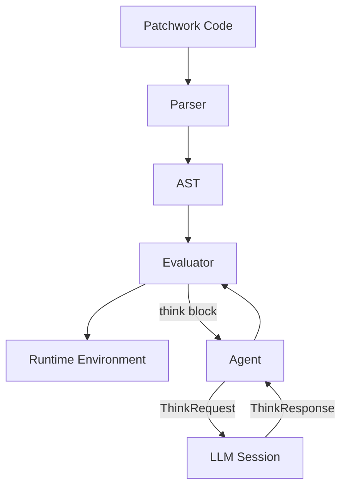

# Introduction

**Patchwork** is a language for orchestrating computation that mixes deterministic code with non-deterministic LLM "thinking." This book explains how the interpreter executes Patchwork programs and communicates with language models.

## The Core Idea

Patchwork programs interleave two kinds of computation:

1. **Deterministic blocks** - Traditional code that always produces the same output: variables, loops, file I/O, shell commands
2. **Think blocks** - Prompts sent to an LLM, whose output is non-deterministic

The interesting part: a think block can trigger deterministic code (via tool calls), and that code might itself contain think blocks. This creates a recursive interplay between the interpreter and the LLM.

```
fun analyze_document(doc) {
    var category = think {
        Categorize this document: $doc
        Options: RECEIPT, CONTRACT, PERSONAL
    }

    if category == "RECEIPT" {
        var amount = think {
            Extract the dollar amount from: $doc
        }
        print("Receipt for $amount")
    }
}
```

## Why This Matters

This execution model enables:

- **Auditability** - You can trace exactly what decisions the LLM made and why
- **Composition** - Deterministic scaffolding with LLM "escape hatches" where judgment is needed
- **Recursion** - LLM decisions can trigger further LLM decisions, nested arbitrarily deep

## Architecture Overview

The interpreter has several key components:



- **Runtime** - Manages variable scopes and execution context
- **Evaluator** - Walks the AST, executing expressions and statements
- **Agent** - Bridges the synchronous interpreter to async LLM sessions
- **ACP Proxy** - Integrates Patchwork into the Agent Communication Protocol

## What's in This Book

- **The Value System** - Runtime values: strings, numbers, arrays, objects
- **The Runtime** - Variable scopes and execution environment
- **An Example Program** - A concrete program to ground the concepts
- **The Evaluator** - How expressions and statements execute
- **Think Blocks** - The core innovation: blocking on LLM responses
- **The Agent** - Managing concurrent LLM sessions
- **The ACP Proxy** - Protocol integration
- **Nested Think Blocks** - Deep dive into recursive execution
