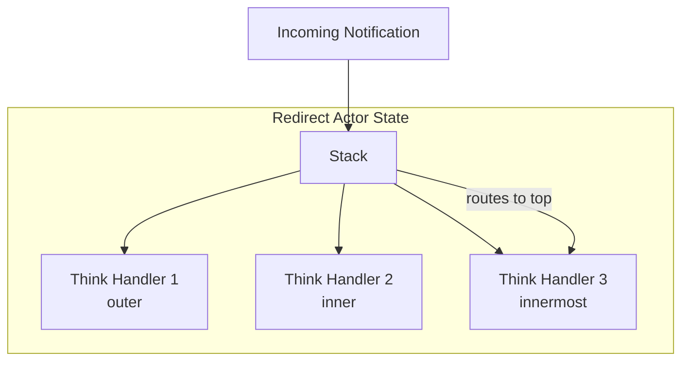
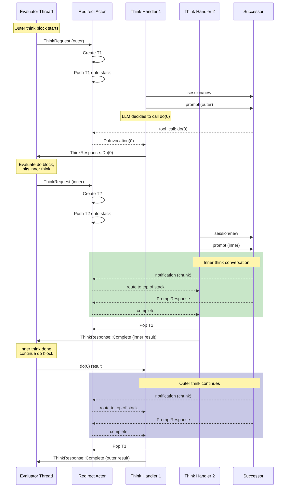
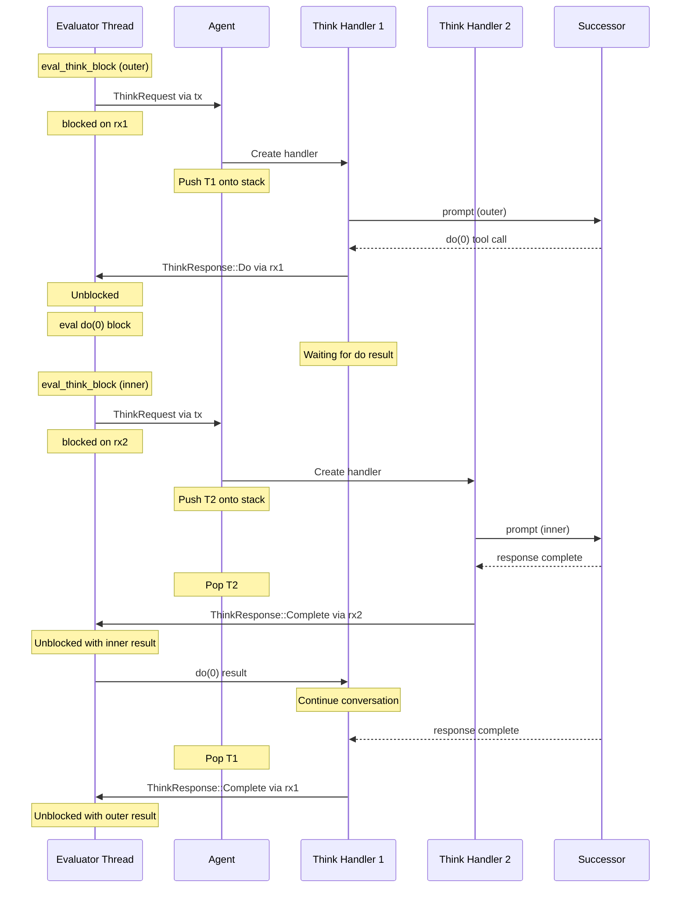
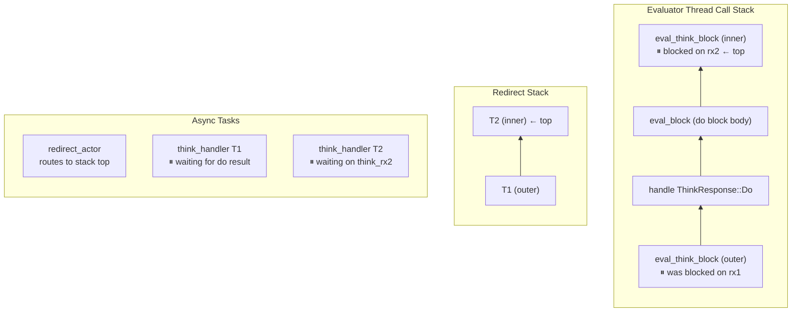

# Nested Think Blocks

Think blocks can nest: deterministic code inside a think block might itself contain think blocks. This chapter explains how the system handles this recursive interplay without deadlock.

## When Nesting Occurs

Nested think blocks arise when:

1. A think block includes code fragments the LLM can execute via the `do` tool
2. That code contains another think block
3. The inner think must complete before the outer think can continue

```patchwork
var analysis = think {
    Analyze this code and determine what tests to write.

    You can run this to see the current tests:
    do {
        $ ls tests/
    }

    You can also ask for clarification:
    do {
        var answer = think {
            What testing framework does this project use?
        }
        print(answer)
    }
}
```

Here the outer think might invoke the inner `do` blocks, each of which could trigger further think blocks.

## The Stack-Based Solution

The redirect actor maintains a stack of active think handlers:



When a notification arrives from the successor, it goes to the **top of the stack**—the innermost active think block. This is correct because:

- The innermost think is the one currently waiting for LLM responses
- Outer thinks are blocked, waiting for their `do` invocations to complete
- When the innermost completes, it pops off, and the next one down becomes active

## Execution Flow

Here's what happens when nested think blocks execute:



## Why This Doesn't Deadlock

The key insight is that **different channels are used at each level**:

| Component | Waits On | Sends To |
|-----------|----------|----------|
| Evaluator (outer think) | `rx1` ([std::sync::mpsc](https://doc.rust-lang.org/std/sync/mpsc/index.html)) | Agent via `tx` ([tokio::sync::mpsc](https://docs.rs/tokio/latest/tokio/sync/mpsc/index.html)) |
| Think Handler 1 | `think_rx1` ([tokio::sync::mpsc](https://docs.rs/tokio/latest/tokio/sync/mpsc/index.html)) | Evaluator via `response_tx1` |
| Evaluator (inner think) | `rx2` ([std::sync::mpsc](https://doc.rust-lang.org/std/sync/mpsc/index.html)) | Agent via `tx` ([tokio::sync::mpsc](https://docs.rs/tokio/latest/tokio/sync/mpsc/index.html)) |
| Think Handler 2 | `think_rx2` ([tokio::sync::mpsc](https://docs.rs/tokio/latest/tokio/sync/mpsc/index.html)) | Evaluator via `response_tx2` |

Each think block creates a fresh `response_tx`/`response_rx` pair. The evaluator blocks on its receiver, but the async runtime continues processing. When the inner think completes, it sends on `response_tx2`, unblocking the evaluator, which then sends the result back to the outer think handler.

## The Channel Dance

Let's trace the channels at maximum nesting:



## Call Stack at Deepest Point

When the inner think is waiting for its LLM response, here's the state of each stack. Stacks grow upward—the top of each stack is the most recently pushed frame:



The evaluator's call stack and the redirect stack grow in parallel. When the inner think completes, T2 pops off the redirect stack, and the evaluator unwinds back to the outer think's `ThinkResponse::Do` handler.

## Arbitrary Depth

This pattern supports arbitrary nesting depth. Each level:

1. Creates its own response channel pair
2. Pushes a new think handler onto the redirect stack
3. The innermost handler receives all notifications
4. On completion, pops and returns control to the next level

The only limits are:
- Stack space in the evaluator thread (for deeply nested Rust calls)
- Memory for the channel buffers and think handlers

## Implementation Notes

The redirect actor is simple—it just routes to the top of the stack:

```rust
async fn redirect_actor(mut rx: UnboundedReceiver<RedirectMessage>) {
    let mut stack: Vec<Sender<PerSessionMessage>> = vec![];

    while let Some(message) = rx.recv().await {
        match message {
            RedirectMessage::IncomingMessage(msg) => {
                if let Some(sender) = stack.last() {
                    sender.send(msg).await?;
                }
            }
            RedirectMessage::PushThinker(sender) => {
                stack.push(sender);
            }
            RedirectMessage::PopThinker => {
                stack.pop();
            }
        }
    }
}
```

The complexity is in understanding the overall flow, not in any single component.
