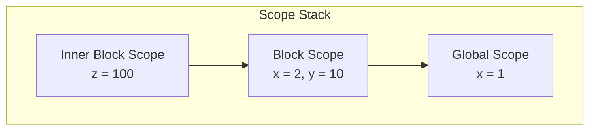
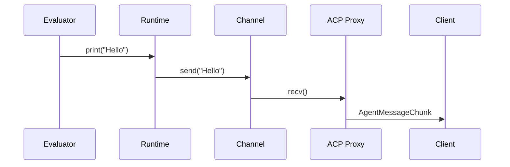

# The Runtime

The `Runtime` struct in `crates/patchwork-eval/src/runtime.rs` manages the execution environment: variable bindings, working directory, and output redirection.

## Structure

```rust
pub struct Runtime {
    scopes: Vec<HashMap<String, Value>>,
    working_dir: PathBuf,
    print_sink: Option<PrintSink>,
}
```

## Variable Scopes

Patchwork uses lexical scoping with a scope stack. Each block creates a new scope; variables in inner scopes shadow outer ones.



### Scope Operations

| Method | Description |
|--------|-------------|
| `push_scope()` | Enter a block - push new empty scope |
| `pop_scope()` | Leave a block - pop current scope |
| `define_var(name, value)` | Create variable in current scope |
| `get_var(name)` | Look up variable (inner to outer) |
| `set_var(name, value)` | Update existing variable |

Variable lookup walks from innermost to outermost scope:

```rust
pub fn get_var(&self, name: &str) -> Option<&Value> {
    for scope in self.scopes.iter().rev() {
        if let Some(value) = scope.get(name) {
            return Some(value);
        }
    }
    None
}
```

### Shadowing Example

```patchwork
var x = 1
{
    var x = 2      // shadows outer x
    print(x)       // prints 2
}
print(x)           // prints 1 (outer x restored)
```

## Working Directory

The runtime tracks a working directory for file operations and shell commands:

```rust
pub fn working_dir(&self) -> &PathBuf { &self.working_dir }
pub fn set_working_dir(&mut self, dir: PathBuf) { self.working_dir = dir; }
```

This is used by:
- `read(path)` and `write(path, content)` builtins
- Shell command execution (`$ ls`, etc.)

Relative paths are resolved against this directory, not the process CWD.

## Print Sink

By default, `print()` writes to stdout. But the runtime supports redirecting output through a channel:

```rust
pub type PrintSink = Sender<String>;

pub fn set_print_sink(&mut self, sink: PrintSink) {
    self.print_sink = Some(sink);
}

pub fn print(&self, message: String) -> Result<(), String> {
    if let Some(ref sink) = self.print_sink {
        sink.send(message).map_err(|e| /* ... */)
    } else {
        println!("{}", message);
        Ok(())
    }
}
```

This is critical for ACP integration - print output needs to be sent as `SessionNotification::AgentMessageChunk` messages rather than going to stdout. The ACP proxy sets up a channel and forwards messages:



## Interpreter Integration

The `Interpreter` struct wraps the runtime and optionally an agent handle:

```rust
pub struct Interpreter {
    runtime: Runtime,
    agent: Option<AgentHandle>,
}
```

The interpreter provides the entry point for evaluation:

```rust
impl Interpreter {
    pub fn eval(&mut self, code: &str) -> Result<Value> {
        // Parse code, execute program
    }
}
```

See `crates/patchwork-eval/src/interpreter.rs` for the full implementation.
