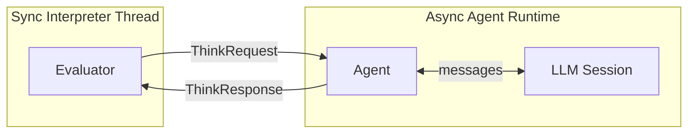
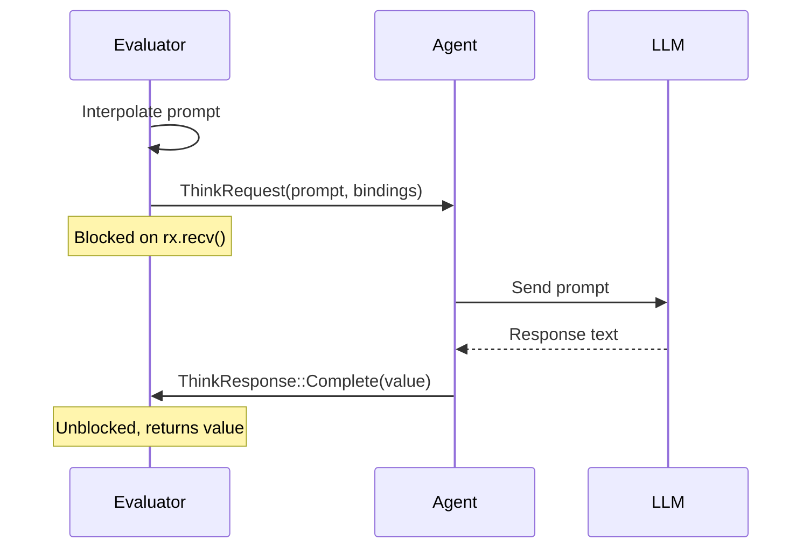

# Think Blocks

Think blocks are where Patchwork code yields control to an LLM. The interpreter sends a prompt and blocks until the LLM responds. This chapter covers the mechanics of that handoff.

## The Core Abstraction

A think block looks like any other expression to the evaluator:

```rust
Expr::Think(prompt_block) => eval_think_block(prompt_block, runtime, agent)
```

But inside `eval_think_block`, something unusual happens: the interpreter thread blocks on a channel, waiting for an external response.

## Prompt Interpolation

Before sending to the LLM, the prompt text is interpolated. Variables and expressions inside `${}` are evaluated:

```rust
fn eval_think_block(
    prompt_block: &PromptBlock,
    runtime: &mut Runtime,
    agent: Option<&AgentHandle>,
) -> Result<Value, Error> {
    let mut prompt_text = String::new();

    for item in &prompt_block.items {
        match item {
            PromptItem::Text(text) => {
                prompt_text.push_str(text);
            }
            PromptItem::Interpolation(expr) => {
                let value = eval_expr(expr, runtime, agent)?;
                prompt_text.push_str(&value.to_string_value());
            }
            PromptItem::Code(block) => {
                // Embedded code blocks execute but don't add to prompt
                eval_block(block, runtime, agent)?;
            }
        }
    }
    // ... send to agent
}
```

This transforms:

```patchwork
var name = "OAuth"
think {
    Analyze the ${name} implementation in these files:
    ${files}
}
```

Into a concrete prompt string before it's sent to the LLM.

## Channel Architecture

The interpreter uses two different channel types to bridge sync and async worlds:



| Direction | Channel Type | Why |
|-----------|--------------|-----|
| Request (Interpreter → Agent) | `tokio::mpsc::UnboundedSender` | Non-blocking send from sync code |
| Response (Agent → Interpreter) | `std::sync::mpsc::Receiver` | Blocking receive in sync code |

This asymmetry is deliberate: the interpreter can fire off a request without blocking, but then blocks waiting for the response.

## The Request/Response Protocol

### ThinkRequest

Sent from interpreter to agent:

```rust
pub struct ThinkRequest {
    /// The interpolated prompt text
    pub prompt: String,
    /// Variable bindings from the current scope
    pub bindings: HashMap<String, Value>,
    /// Expected response type ("string", "json", etc.)
    pub expect: String,
    /// Channel to receive responses
    pub response_tx: mpsc::Sender<ThinkResponse>,
}
```

The `response_tx` is created fresh for each think block, so responses are routed back to the correct waiting interpreter. This becomes important with nested think blocks, covered in a [later chapter](./nested-thinks.md).

### ThinkResponse

The agent sends one or more responses:

```rust
pub enum ThinkResponse {
    /// LLM wants to execute code (recursive evaluation)
    Do {
        index: usize,
        result_tx: mpsc::SyncSender<String>,
    },
    /// Think block completed
    Complete {
        result: Result<Value, String>,
    },
}
```

A typical think block receives exactly one `Complete`. But if the LLM invokes tools that trigger code execution, the interpreter may receive `Do` messages first.

## Blocking Semantics

The interpreter blocks in a simple loop:

```rust
// Send request
let rx = agent.think(prompt_text, bindings, "string".to_string())?;

// Block waiting for responses
for response in rx {
    match response {
        ThinkResponse::Do { index, result_tx } => {
            // Recursive evaluation (covered in Nested Think Blocks)
            let result = /* evaluate child */;
            result_tx.send(result)?;
        }
        ThinkResponse::Complete { result } => {
            return result.map_err(Error::Runtime);
        }
    }
}
```

The `for response in rx` loop blocks until the channel closes or `Complete` arrives.

## Sequence Diagram

A simple think block without tool calls:



## No Agent Mode

When testing or running without an LLM, `agent` is `None`. The evaluator returns a placeholder:

```rust
if agent.is_none() {
    let mut result = HashMap::new();
    result.insert("__think_prompt".to_string(), Value::String(prompt_text));
    return Ok(Value::Object(result));
}
```

This lets tests verify that prompt interpolation works without needing a real LLM.

## Next: The Agent

The interpreter side is straightforward—send request, block, receive response. The complexity lives in the [Agent](./agent.md), which manages LLM sessions and routes messages.
