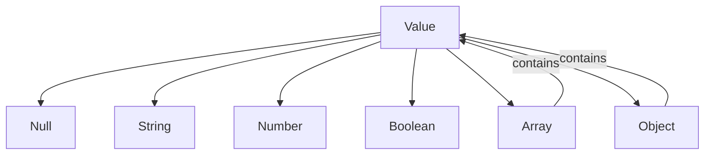

# The Value System

Patchwork has a simple, JSON-compatible type system. All runtime values are represented by the `Value` enum in `crates/patchwork-eval/src/value.rs`.

## Value Types

```rust
pub enum Value {
    Null,
    String(String),
    Number(f64),
    Boolean(bool),
    Array(Vec<Value>),
    Object(HashMap<String, Value>),
}
```

Like JavaScript, Patchwork uses `f64` for all numbers - there's no integer/float distinction.

## Type Hierarchy



Arrays and objects can contain any value type, including nested arrays and objects.

## JSON Interoperability

Values convert seamlessly to and from JSON:

```rust
// Parse JSON string into Value
let value = Value::from_json(r#"{"name": "test", "count": 42}"#)?;

// Convert Value to JSON string
let json = value.to_json();  // Pretty-printed
```

This is used by the `json()` and `cat()` builtin functions:

```
var data = json(read("config.json"))  // Parse file as JSON
var output = cat(data)                 // Serialize back to JSON string
```

## Type Coercion

Values support coercion to strings and booleans for use in string interpolation and conditionals.

### String Coercion (`to_string_value`)

| Type | Result |
|------|--------|
| Null | `"null"` |
| String | itself |
| Number | formatted (integers without `.0`) |
| Boolean | `"true"` or `"false"` |
| Array | comma-separated elements |
| Object | `"[object Object]"` |

### Boolean Coercion (`to_bool`)

| Type | Truthy | Falsy |
|------|--------|-------|
| Null | - | always |
| String | non-empty | empty |
| Number | non-zero, non-NaN | 0, NaN |
| Boolean | true | false |
| Array | non-empty | empty |
| Object | always | - |

This powers conditionals and loops:

```
var items = json(read("data.json"))
if items {  // truthy if non-empty array
    for var item in items {
        print(item.name)
    }
}
```

## Implementation Notes

The `Value` type is designed to be:

- **Clone-friendly** - Values are cloned when assigned to variables
- **Debug-friendly** - Implements `Debug` for tracing
- **Comparable** - Implements `PartialEq` for equality checks

See `crates/patchwork-eval/src/value.rs` for the full implementation.
